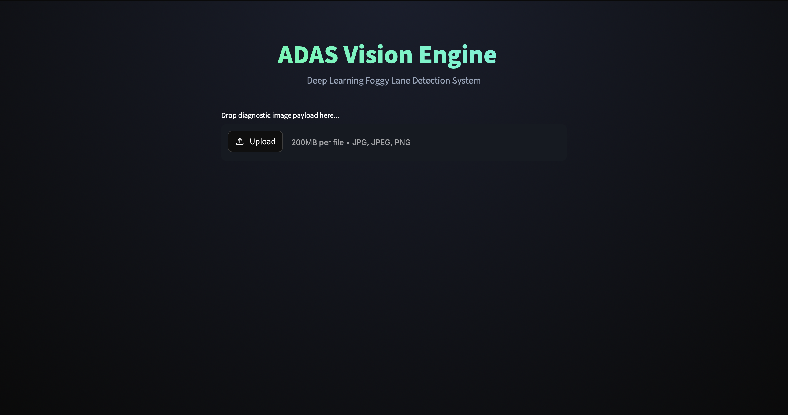

# Robust Foggy Lane Detection using U-Net for ADAS

<div align="center">
  
</div>

## Overview
This project implements a Deep Learning-based pipeline for robust lane detection, specifically designed to function reliably in adverse weather conditions like heavy fog. Traditional computer vision approaches (such as Canny edge detection or Hough transforms) often fail when visibility drops or road conditions change. This system leverages a **U-Net** semantic segmentation architecture to ensure Advanced Driver Assistance Systems (ADAS) can safely identify lanes regardless of the environment.

## Key Features
- **Deep Learning Architecture:** Utilizes a custom PyTorch U-Net model to perform pixel-perfect semantic segmentation.
- **Multi-Dataset Training:** Trained on a combination of the **TuSimple** dataset (for standard highway baseline) and the **BDD100K** dataset (for diverse weather, lighting, and complex road conditions).
- **Interactive UI:** Includes a Streamlit web application that allows users to upload test images, adjust model sensitivity dynamically, and view real-time lane predictions.
  <br>
  <div align="center">
    
  </div>
  <br>
- **Fog Mitigation:** Integrates preprocessing dehazing algorithms to assist the U-Net in extreme low-visibility scenarios.

## Project Structure
- `model/unet.py`: Defines the PyTorch U-Net architecture.
- `train.py`: The main training loop used to teach the model on the datasets.
- `evaluate.py`: Calculates quantitative metrics like F1-Score and Intersection over Union (IoU) against a validation set.
- `dataset_loader.py` & `bdd_loader.py`: Handles loading, transforming, and batching of the TuSimple and BDD100K datasets.
- `app.py`: The Streamlit web interface for testing the model visually.

## Installation & Setup
1. **Clone the repository:**
   ```bash
   git clone <your-github-repo-link>
   cd foggy-lane-detection
   ```

2. **Create and activate a virtual environment:**
   ```bash
   python -m venv .venv
   source .venv/bin/activate  # On Windows use: .venv\Scripts\activate
   ```

3. **Install Dependencies:**
   ```bash
   pip install -r requirements.txt
   ```

4. **Datasets & Weights:**
   *(Note: Datasets and model weights are not included in this repository due to size constraints. You must download the TuSimple and BDD100k datasets manually and place them in their respective folders, then run `train.py` to generate weights).*

## Running the Application
To launch the interactive ADAS Vision Engine web interface:
```bash
streamlit run app.py
```

## Running Model Training & Evaluation
To train the model from scratch:
```bash
python train.py
```

To evaluate the model's accuracy (F1-Score and IoU):
```bash
python evaluate.py
```
